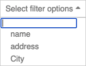

### Introduction
A dropdown for react application

### Usage
    const arr = [
        {value: 0, text: 'gender'},
        {value: 1, text: 'country'},
        {value: 'a6', text: 'time'}
    ]

    class App extends React.Component {
        constructor(props, context) {
            super(props, context);
            this.state = {
                value:1, 
                selectedItem:null
            }
            this.myRef = React.createRef()
        }
        
        updateSelectedItem(selectedItem){
            this.setState({selectedItem}, ()=>{
                console.log(this.state.selectedItem)
            })
        }
    
        render() {
            return <Component 
                data={arr} // [{text:'item0', value:'0'}, {text:'item1', value:'1'}{text:'item2', value:'2'}]
                value={this.state.value} // 1
                placeHolderStr='please select an item'
                onChange={onChange={this.updateSelectedItem.bind(this)}}
                // check index.js for more parameters
            />
        }
    }

